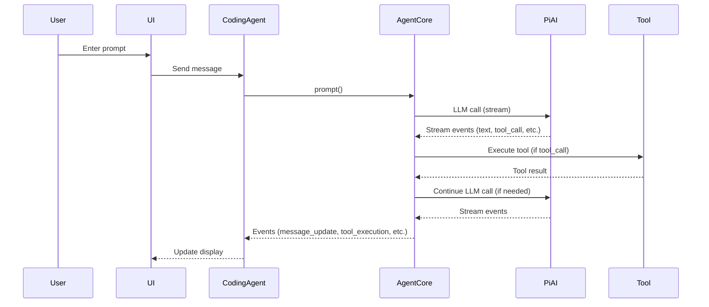
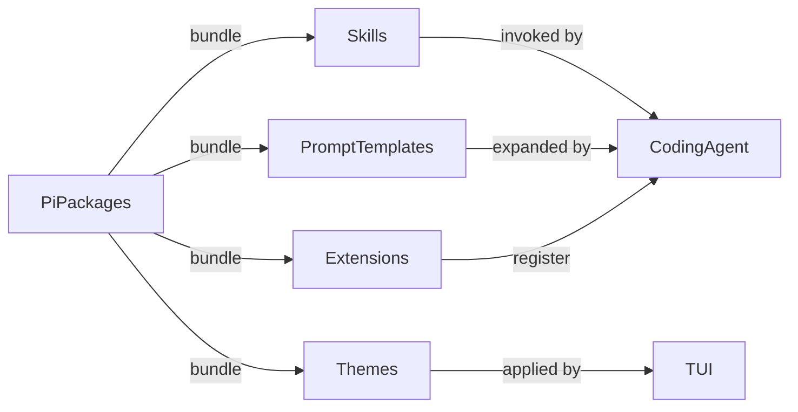
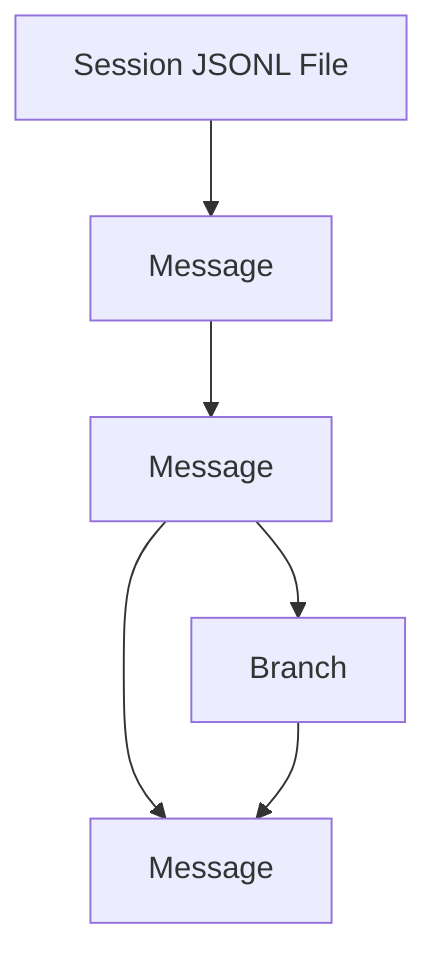

# What is Pi? A Deep Dive into the Architecture, Capabilities, and Workflows of the Pi Project

---

## Table of Contents

1. [Introduction](#introduction)
2. [High-Level Architecture](#high-level-architecture)
3. [Core Packages and Their Roles](#core-packages-and-their-roles)
    - [pi-coding-agent](#pi-coding-agent)
    - [pi-ai](#pi-ai)
    - [pi-agent-core](#pi-agent-core)
    - [pi-tui](#pi-tui)
    - [pi-web-ui](#pi-web-ui)
    - [pi-mom](#pi-mom)
    - [pi-pods](#pi-pods)
4. [How Pi Works: End-to-End Flow](#how-pi-works-end-to-end-flow)
5. [Extensibility: Skills, Extensions, and Packages](#extensibility-skills-extensions-and-packages)
6. [Session and Context Management](#session-and-context-management)
7. [Security and Isolation](#security-and-isolation)
8. [Glossary](#glossary)
9. [Mermaid Diagrams](#mermaid-diagrams)

---

## Introduction

**Pi** is a modular, extensible platform for building, running, and managing AI agents—especially coding agents—across terminal, web, and chat environments. It is designed for technical users who want full control, deep extensibility, and the ability to adapt agentic workflows to their own needs, without being locked into a single provider or UI.

Pi is not just a coding agent CLI. It is a toolkit and runtime for agentic workflows, with a focus on tool calling, stateful sessions, and seamless integration with LLMs from all major providers.

---

## High-Level Architecture

```mermaid
graph TD
    subgraph User Interfaces
        TUI[Terminal UI (pi-tui)]
        WebUI[Web UI (pi-web-ui)]
        Slack[Slack Bot (pi-mom)]
    end
    subgraph Core
        CodingAgent[pi-coding-agent]
        AgentCore[pi-agent-core]
        PiAI[pi-ai]
    end
    subgraph Infrastructure
        Pods[pi-pods]
    end
    TUI -->|uses| CodingAgent
    WebUI -->|uses| CodingAgent
    Slack -->|uses| CodingAgent
    CodingAgent -->|uses| AgentCore
    AgentCore -->|uses| PiAI
    CodingAgent -->|uses| PiAI
    WebUI -->|uses| AgentCore
    WebUI -->|uses| PiAI
    Pods -->|manages| PiAI
```

---

## Core Packages and Their Roles

### pi-coding-agent

- **Entry point for most users**: CLI, interactive mode, print/JSON/RPC/SDK modes.
- **Extensible**: Add skills, prompt templates, extensions, and themes.
- **Session management**: Branching, compaction, context files.
- **Tooling**: Built-in tools (read, write, edit, bash), plus user-defined skills.
- **Modes**: Interactive, print, JSON, RPC, SDK.
- **Customization**: Everything is pluggable—no forking required.

### pi-ai

- **Unified LLM API**: Abstracts over OpenAI, Anthropic, Google, Mistral, Groq, xAI, and more.
- **Model registry**: Discovers and manages models and providers.
- **Tool calling**: Type-safe, streaming, partial JSON, validation.
- **Context handoff**: Seamless cross-provider context transfer.
- **Token/cost tracking**: Unified usage and cost reporting.
- **Extensible**: Add new providers, custom models, and APIs.

### pi-agent-core

- **Agent runtime**: Stateful agent loop, tool execution, event streaming.
- **Event-driven**: Emits events for UI updates, tool calls, and state changes.
- **Customizable**: Supports custom message types, context transforms, and toolchains.
- **Low-level API**: For advanced integrations and custom agent loops.

### pi-tui

- **Terminal UI framework**: Differential rendering, atomic updates, flicker-free.
- **Component-based**: Text, editor, markdown, loader, select list, image, etc.
- **Keyboard and IME support**: Handles complex input, overlays, and focus.
- **Themeable**: Hot-reloadable themes, custom components.

### pi-web-ui

- **Web components**: Chat UI, artifacts, attachments, storage, dialogs.
- **Agent integration**: Uses pi-agent-core and pi-ai for backend logic.
- **IndexedDB storage**: Sessions, API keys, settings, custom providers.
- **Custom tools**: JavaScript REPL, document extraction, artifact management.

### pi-mom

- **Slack bot**: LLM-powered, self-managing, tool-using agent for Slack.
- **Workspace isolation**: Each channel/DM has its own context, memory, and files.
- **Tooling**: Bash, read, write, edit, attach, plus user-defined skills.
- **Event system**: Scheduled, immediate, and periodic events.
- **Security**: Docker sandboxing, credential management, access control.

### pi-pods

- **LLM deployment manager**: Automates vLLM setup on GPU pods.
- **Model management**: Start/stop models, GPU allocation, context sizing.
- **API endpoints**: Exposes OpenAI-compatible APIs for all models.
- **Agent integration**: Test agentic capabilities directly on pods.

---

## How Pi Works: End-to-End Flow

### 1. User Interaction
- User interacts via terminal (TUI), web, or Slack.
- Input is captured and sent to the coding agent.

### 2. Agent Loop
- The agent loop (in pi-agent-core) manages the conversation state, tool calls, and LLM interactions.
- Messages are transformed, context is pruned/compacted, and tool calls are validated.

### 3. LLM API
- pi-ai selects the appropriate provider/model, handles authentication, and streams events (text, tool calls, thinking, etc.).
- Tool calls are validated and executed, results are injected back into the context.

### 4. Tool Execution
- Built-in tools (read, write, edit, bash) or user-defined skills are executed.
- Results are streamed back to the agent and user interface.

### 5. Session Management
- All interactions are stored as JSONL session trees, supporting branching, compaction, and infinite history.

### 6. Extensibility
- Users can add skills, prompt templates, extensions, and themes at runtime.
- Pi packages bundle and share these resources via npm or git.

#### Sequence Diagram: Agent Loop with Tool Calls



---

## Extensibility: Skills, Extensions, and Packages

- **Skills**: On-demand CLI tools, described by SKILL.md, invoked by the agent.
- **Prompt Templates**: Markdown files with variables, expanded via `/templatename`.
- **Extensions**: TypeScript modules that add tools, commands, UI, and event handlers.
- **Themes**: Hot-reloadable color and style definitions.
- **Pi Packages**: Bundle and share any of the above via npm or git.



---

## Session and Context Management

- **Sessions**: Stored as JSONL trees, supporting branching, compaction, and infinite history.
- **Context files**: AGENTS.md, MEMORY.md, and SYSTEM.md provide project and user instructions.
- **Compaction**: Summarizes old messages to fit within LLM context windows.
- **Branching**: Navigate and fork session trees for experimentation.



---

## Security and Isolation

- **Docker sandboxing**: Isolates tool execution (especially in pi-mom).
- **Credential management**: API keys, OAuth, and per-channel secrets.
- **Access control**: Multiple mom instances for different teams/security levels.
- **Prompt injection mitigation**: User education, channel isolation, and credential scoping.

---

## Glossary

- **Agent**: A stateful process that manages conversation, tool calls, and LLM interactions.
- **Tool**: An external function (read, write, bash, etc.) the agent can call.
- **Skill**: A user-defined CLI tool, described by SKILL.md, that the agent can invoke.
- **Extension**: TypeScript module that adds or modifies agent capabilities.
- **Prompt Template**: Markdown file with variables, expanded into prompts.
- **Session**: A tree-structured log of all messages, tool calls, and results.
- **Compaction**: Summarizing old session history to fit within LLM context windows.
- **Context File**: Markdown or JSONL file (AGENTS.md, MEMORY.md, SYSTEM.md) loaded at startup.
- **Provider**: An LLM backend (OpenAI, Anthropic, Google, etc.).
- **Model**: A specific LLM (e.g., gpt-4o, claude-sonnet-4).
- **Branching**: Creating alternate session histories from any point.
- **TUI**: Terminal User Interface.
- **Artifacts**: Files (HTML, SVG, Markdown, etc.) generated by the agent.
- **Pods**: Remote GPU servers managed by pi-pods for LLM hosting.

---

## Mermaid Diagrams

### High-Level Architecture

```mermaid
graph TD
    subgraph User Interfaces
        TUI[Terminal UI (pi-tui)]
        WebUI[Web UI (pi-web-ui)]
        Slack[Slack Bot (pi-mom)]
    end
    subgraph Core
        CodingAgent[pi-coding-agent]
        AgentCore[pi-agent-core]
        PiAI[pi-ai]
    end
    subgraph Infrastructure
        Pods[pi-pods]
    end
    TUI -->|uses| CodingAgent
    WebUI -->|uses| CodingAgent
    Slack -->|uses| CodingAgent
    CodingAgent -->|uses| AgentCore
    AgentCore -->|uses| PiAI
    CodingAgent -->|uses| PiAI
    WebUI -->|uses| AgentCore
    WebUI -->|uses| PiAI
    Pods -->|manages| PiAI
```

### Agent Loop with Tool Calls


### Extensibility Graph


### Session Tree Structure


---

## Conclusion

Pi is a deeply extensible, provider-agnostic agentic platform for technical users. Its modular architecture, rich tool and extension system, and robust session management make it suitable for everything from interactive coding agents to Slack bots and LLM deployment managers. Whether you want to build your own agent workflows, integrate with custom tools, or deploy models on GPU pods, Pi provides the building blocks and flexibility to do so.
